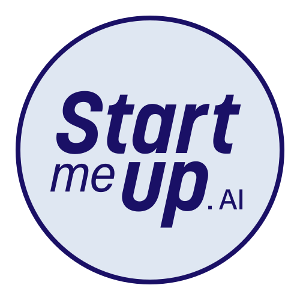

  
  <h3>Build. Launch. Scale.</h3>
  
Practical AI products and engineering systems for founders and teams.

# Start Me Up .AI Community Defaults

This repository holds the public GitHub profile and the default
community-health files used across the
[Start Me Up .AI organization](https://github.com/startmeupai). Individual
repositories override these defaults when they need project-specific guidance.

## Who We Are

[Start Me Up .AI](https://www.startmeup.ai) (also written StartMeUp.AI, or
smuai for short) builds production-ready AI products and engineering systems
for founders and teams.

**[Byblos AI](https://byblosai.app)** is our flagship product: an AI co-founder
that plans your product, builds your brand, and runs campaigns with AI agents
that share one project context, while humans stay in control.

[Explore Byblos AI →](https://byblosai.app)

## What Lives Here

- `profile/README.md` — organization profile displayed on GitHub
- `profile/assets/` — logos and profile assets
- `CONTRIBUTING.md` — contribution workflow and inbound license terms
- `CODE_OF_CONDUCT.md` — Contributor Covenant 2.1
- `SECURITY.md` — private vulnerability reporting
- `SUPPORT.md` — where to ask for help
- `.github/ISSUE_TEMPLATE/` — bug report and feature request forms
- `.github/PULL_REQUEST_TEMPLATE.md` — pull request checklist

## Connect

  <a href="https://www.startmeup.ai"><strong>Start Me Up .AI</strong></a> ·
  <a href="https://byblosai.app"><strong>Byblos AI</strong></a> ·
  <a href="https://www.linkedin.com/company/startmeupai"><strong>LinkedIn</strong></a> ·
  <code>contact@startmeup.ai</code>

