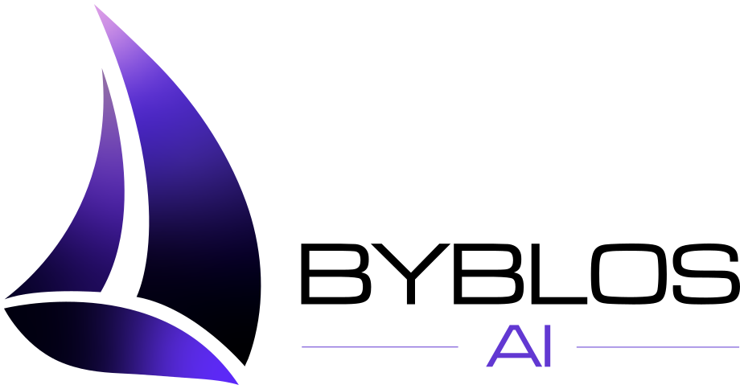

  

# Start Me Up .AI

We build practical AI products and engineering systems for founders and teams.
Our open-source work shares reusable patterns for building, testing, and
governing AI-assisted software.

## Our Product

<a href="https://byblosai.app">
  <picture>
    <source media="(prefers-color-scheme: dark)" srcset="assets/byblosai-lockup-dark.svg">
    
  </picture>
</a>

### [Byblos AI](https://byblosai.app)

Your AI co-founder: plan your product, build your brand, and run campaigns with
AI agents that share one project. Product Manager, Brand Manager, and Campaign
Manager agents work from the same context, and coding agents such as Claude
Code can read the PRD and roadmap through the Byblos AI MCP connector.

## Featured Open-Source Project

### [SWE Agents](https://github.com/startmeupai/swe-agents)

A portable reference for organizing AI-assisted software engineering across
Codex, Claude Code, and GitHub Copilot. It includes reusable agent personas,
skills, deterministic checks, documentation, and evidence-driven workflows.

## Contributing

Contributions are welcome through issues and pull requests. Each repository
contains its own setup and verification requirements; Start Me Up .AI's default
community standards apply when a project does not provide more specific rules.

- Search existing issues before opening a new one.
- Discuss large changes before investing substantial implementation effort.
- Fork the repository, create a focused branch, and open a pull request.
- Report vulnerabilities privately through the repository's Security tab.

## Community

We value focused contributions, respectful technical discussion, least
privilege, reproducible verification, and honest reporting of what was and was
not tested.

## Connect

- [Start Me Up .AI](https://www.startmeup.ai)
- [Byblos AI](https://byblosai.app)
- [LinkedIn](https://www.linkedin.com/company/startmeupai)
- Email: `contact@startmeup.ai`
